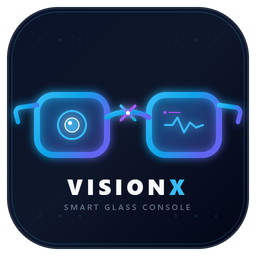

<div align="center">



# VisionX - 开源多模态 AI 智能眼镜全栈平台
### Open-Source Multimodal AI Smart Glasses: Hardware, Firmware & PC Debug Console

[](https://github.com/NovaMindLab/VisionX/releases)
[](https://opensource.org/licenses/MIT)
[](https://www.seeedstudio.com/XIAO-ESP32S3-Sense-p-5639.html)
[]()
[]()
[]()

<p align="center">
  <b>极轻量可穿戴硬件 · 零堆碎片流式图传 · 全功能桌面调试控制台 · Blockmap 差分极速升级</b>
</p>

[📥 立即下载客户端](https://github.com/NovaMindLab/VisionX/releases/latest) • [📚 深入开发 Wiki](./wiki/README.md) • [🖨️ 3D 模型库](./3d_models/) • [🛠️ 硬件清单 (BOM)](./wiki/02-hardware-bom.md) • [💬 快速上手](#-快速上手指南)

---

</div>

## 📖 项目简介 (Overview)

**VisionX** 是一套专为极客、开发者及 AI 创作者打造的**端-边-云全栈开源 AI 智能眼镜解决方案**。它借鉴并融合了 Ray-Ban Meta、Brilliant Labs Frame 及 BasedHardware Omi 的产品精髓，提供了从 **3D 打印镜架结构设计**、**ESP32-S3 嵌入式驱动固件** 到 **跨平台 Electron 桌面联调控制台** 的完整实现闭环。

无论你是想 DIY 一台专属的第一视角生活记忆 AI 助理，还是开发工业巡检、视觉问答 (VQA)、具身智能第一视角采集终端，VisionX 都能为你提供开箱即用、成熟可靠的工程底座。

---

## 🌟 核心特性 (Key Highlights)

### 👓 1. 极致轻巧的硬件架构 (Ultra-lightweight Hardware)
* **主控核心**：搭载超微型 **Seeed Studio XIAO ESP32-S3 Sense**（双核 Xtensa LX7 @ 240MHz，内置 8MB 高速 OPI PSRAM 与 8MB Flash）；
* **多模态传感器**：集成 **OV2640 200W 像素超小型 DVP 摄像头** 与 **板载数字 PDM 麦克风**；
* **极简穿戴**：整套电路模组体积仅拇指大小，搭配定制 3D 打印镜架，佩戴重量轻至 **35g ~ 40g**，支持全天候无感佩戴。

### ⚡ 2. 独创零堆内存流式图传引擎 (High-performance Streaming)
* **双缓冲 DMA**：利用 ESP32-S3 硬件双缓冲与八线高速 PSRAM，直接捕获 JPEG 图像帧；
* **零堆碎片 Base64 编码**：在固件端仅利用 4 字节微型滑动窗口直接完成 Base64 流式打包，杜绝连续拍照或推流时的内存泄漏与系统崩溃；
* **高速流式定界符解析**：上位机基于协议索引定界符（`===IMG_START===` / `===FRAME_START===`）连续分包截取，免疫串口粘包、断包与尾部丢失；
* **多分辨率无缝切换**：
  * **QVGA (320x240)**：**12 ~ 18 FPS 超流畅连续视频流**，延迟低至 120ms，实时预览首选；
  * **VGA (640x480)**：6 ~ 8 FPS 均衡模式；
  * **SVGA (800x600)**：单张高清晰度拍照，捕捉细节。

### 🖥️ 3. 现代化跨平台桌面调试控制台 (`eproject`)
* 基于 **Electron 41 + Vue 3 + TypeScript + Vite** 构建，拥有现代深色科技感仪表盘；
* **智能串口探测**：自动识别 ESP32-S3 USB CDC 端口，支持热插拔自动重连与 DTR/RTS 自动流控；
* **双模图像工作台**：
  * 单张抓拍成片大图预览（主进程持久化缓存，跨标签页秒级同步）；
  * 连续实时视频流播放器，集成 **实时帧率 (FPS) / 吞吐码率 (KB/s)** 动态监控；
  * 支持一键快照保存至本地文件；
* **专业调试工具栈**：
  * 串口日志终端内置 2000 行环形缓冲、关键词正则高亮过滤、日志一键导出；
  * 硬件自检中心，一键排查摄像头、麦克风、PSRAM、Wi-Fi 状态。

### 🔄 4. 商业级 Blockmap 差分极速增量升级 (Differential Auto-Updates)
* 告别每次升级必须下载 90MB 安装包的痛点；
* 引入 **Blockmap 块级指纹差分升级技术**，客户端自动比对 64KB 数据块哈希；
* **单次版本迭代升级仅需拉取 2MB ~ 5MB 变动数据**，秒级静默下载、一键重启自动安装。

---

## 🏛️ 系统架构图 (Architecture)

```text
+-----------------------------------------------------------------------------------+
|                        VisionX 整体技术架构 (End-to-End Topology)                 |
+-----------------------------------------------------------------------------------+

   [ 智能眼镜终端 (ESP32-S3 Sense) ]
    ├── 摄像头驱动: OV2640 (DVP 8-bit, 2x FrameBuffer in OPI PSRAM)
    ├── 数字音频: 板载数字 PDM 麦克风 (16kHz / 16-bit PCM)
    ├── 通信中继: USB CDC 极速虚拟串口 / BLE 5.0 / 2.4G Wi-Fi
    └── 3D 打印外壳: 模块化镜腿夹扣 / 一体化太阳镜框 (轻至 35g)
                                   │
                                   │ (USB CDC 115200~460800 bps / WebSocket / BLE)
                                   ▼
   [ PC 桌面联调控制台 (Electron + Vue 3) ]
    ├── 串口通信层: SerialPort 13 + 热插拔检测 + 流式定界符解析引擎
    ├── 图像处理层: 流式 Base64 解码器 + 15 FPS 实时视频流渲染器 + 快照引擎
    ├── 硬件诊断台: 自动化外设健康探测 + 2000行环形终端
    └── 自动更新层: electron-updater + Blockmap 差分增量下载
                                   │
                                   │ (HTTPS / WebSocket RESTful API)
                                   ▼
   [ 云端多模态 AI 引擎 (Planned) ]
    ├── 视觉问答 (VQA): Qwen2-VL / GPT-4o / Claude 3.5 Sonnet
    ├── 语音中枢: Whisper / SenseVoice (ASR) + CosyVoice (TTS)
    └── 记忆流引擎: 向量数据库 (Chroma / Milvus) + 长短期情境记忆
```

---

## 🚀 快速上手指南 (Quick Start)

### 选项 A：直接下载 PC 控制台体验 (推荐)
前往 Releases 页面获取预编译的 Windows 最新版本：
* **[📥 下载 VisionX 控制台最新发布版 (v1.0.3)](https://github.com/NovaMindLab/VisionX/releases/latest)**
  * **安装版**：`VisionX-SmartGlass-Console-Setup-1.0.3.exe`（支持桌面快捷方式与后续差分静默升级）；
  * **免安装便携版**：`VisionX-SmartGlass-Console-1.0.3.exe`（绿色软件，双击即开）。

---

### 选项 B：固件极速编译与烧录 (ESP32-S3)
本项目固件支持 **PlatformIO**（推荐）与 **Arduino IDE** 双编译通道。

#### 使用 PlatformIO (CLI / VSCode)：
```bash
# 1. 进入固件目录
cd firmware/camera_debug_pio

# 2. 编译并烧录至开发板 (连接好板载 USB 口)
pio run --target upload

# 3. 查看实时串口调试日志
pio device monitor -b 115200
```

#### 固件驱动参数（重要）：
* **Flash 模式**：QIO 80MHz，容量 8MB；
* **PSRAM 模式**：**OPI PSRAM** 必须启用（8MB 容量）；
* **USB CDC On Boot**：必须设为 `Enabled`（原生 USB 虚拟串口）。

---

### 选项 C：PC 控制台源码运行与二次开发
```bash
# 1. 进入控制台工程
cd eproject

# 2. 安装项目依赖
npm install

# 3. 启动开发模式 (Vite 热重载 + Electron 主窗口)
npm run dev:vue
# 在另一个终端启动 Electron:
npm start

# 4. 构建与打包 Windows EXE 安装包
npm run pack:win
```

---

## 🖨️ 3D 打印与整机装配 (Hardware & 3D Printing)

本项目在 [`3d_models/`](./3d_models/) 目录中提供了两套经过工业实测验证的结构模型：

1. **外挂夹扣原型 (Clip-on Case)**：
   * 专为**现有近视眼镜/墨镜**设计，分为主控盒、电池仓和镜腿转接夹扣，3 件套新手 1 小时即可打印完成；
   * 详情查阅：[`wiki/08-k2-3d-printing-guide.md`](./wiki/08-k2-3d-printing-guide.md)。
2. **一体化镜框模型 (Integrated Frame)**：
   * 完整的太阳镜框一体成型结构，隐藏式走线槽与配重平衡优化。

*推荐打印材料*：PETG、PLA+ 或高精光固化树脂（韧性好、抗汗液腐蚀）。

---

## 📚 详细开发知识库 (Full Documentation)

为了方便深入研究，我们在 [`wiki/`](./wiki/) 和 [`eproject/wiki/`](./eproject/wiki/) 中编写了极其详尽的中文开发指南：

| 章节 | 文档名 | 核心内容 |
| :--- | :--- | :--- |
| **01** | [系统架构与技术选型](./wiki/01-architecture-design.md) | 端-边-云拓扑、BLE/Wi-Fi 传输协议选型、延时评估 |
| **02** | [硬件选型与物料清单 (BOM)](./wiki/02-hardware-bom.md) | 主控、传感器、电池充放电、购买渠道与成本预估 |
| **03** | [固件开发与驱动烧录指南](./wiki/03-firmware-guide.md) | OV2640 寄存器调优、PSRAM 内存分配、PlatformIO 配置 |
| **04** | [摄像头拍照与流式图传深度剖析](./eproject/wiki/02-camera-and-video-streaming.md) | 定界符流式切片引擎、全局图片缓存、USB FIFO 刷新机制 |
| **05** | [Blockmap 差分增量升级体系](./eproject/wiki/05-differential-update-guide.md) | 增量数据块切片、HTTP Range 拉取、发布产物命名与 404 避坑 |
| **06** | [自动化构建与 CI/CD 引擎](./eproject/wiki/04-auto-deploy-and-cicd.md) | 一键发布脚本、GitHub CLI 对接、自动化版本 Bump |
| **07** | [K2 3D 打印实战与参数切片](./wiki/08-k2-3d-printing-guide.md) | 拓竹/创想打印机切片摆盘、支撑设置与后处理装配 |
| **08** | [实机操作与日常使用手册](./wiki/09-user-manual-and-quickstart.md) | 开机指南、即拍即看、状态指示灯说明与故障排查 |

---

## 🗺️ 后续迭代路线图 (Roadmap)

- [x] **v1.0.1**：基础串口通信、OV2640 单张抓拍、初始 Electron 仪表盘
- [x] **v1.0.2**：实现 QVGA 15 FPS 极速视频流直推、语言包裁剪优化 (包体积减少 45MB)
- [x] **v1.0.3**：重构流式定界符解析器、解决拍照展示时序死锁、修复差分升级 404 故障
- [ ] **v1.1.0 (进行中)**：
  - [ ] **多模态 AI 识图工作流**：在控制台集成 Qwen2-VL / OpenAI 接口，点击拍照直接调用 AI 问答；
  - [ ] **PDM 麦克风音频测试台**：实时采集眼镜麦克风声音，绘制 WebAudio 声波示波器并录制 WAV；
  - [ ] **相机高级调参调色板**：支持在线调节 OV2640 亮度、对比度、饱和度、白平衡与特殊特效。
- [ ] **v2.0.0 (规划)**：
  - [ ] 基于 BLE + Wi-Fi 的无线双模图传；
  - [ ] 单绿光 Micro-OLED / 光波导 HUD 显示拓展。

---

## 🤝 参与贡献 (Contributing)

我们非常欢迎社区开发者提交 Issue、提出需求或贡献代码！
1. Fork 本仓库并新建分支 (`git checkout -b feature/AmazingFeature`)；
2. 提交你的修改 (`git commit -m 'feat: Add some AmazingFeature'`)；
3. 推送分支到 GitHub (`git push origin feature/AmazingFeature`)；
4. 发起 Pull Request。

---

## 📄 开源许可证 (License)

本项目采用 **[MIT 许可证](./LICENSE)** 开源。商业友好，保留署名即可自由修改、分发与二次衍生。

---

<div align="center">
  <b>🌟 如果 VisionX 对你的 DIY 创作或智能眼镜研发有所启发，欢迎右上角点个 Star 支持我们！</b><br>
  <sub>Crafted with ❤️ by NovaMindLab Team</sub>
</div>
