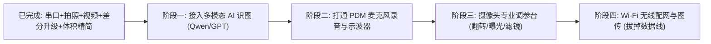

# 06 - 功能规划与迭代 TODO 清单 (Roadmap)

本文档记录 **Smart Glass Debug Console** 在完成串口、图传与差分升级后的进阶功能规划。

---

## 阶段路线总览

---

## 待开发清单详情

### 🌟 模块一：多模态 AI 视觉感知与问答 (Vision AI Assistant) 【P0 核心】
- [ ] **视觉大模型接入**：支持通义千问 `Qwen2-VL`、`GPT-4o`、`Gemini 1.5 Pro` 及本地离线模型 `Ollama LLaVA`。
- [ ] **AI 识图侧边栏**：`CameraView` 界面增加一键“AI 识图问答”对话流面板，快捷键空格随按随问。
- [ ] **场景模式预设**：眼前物体解析、中英路标/书籍文字提取、工业维修指引。
- [ ] **实时 HUD 图层**：十字准星、九宫格构图辅助线、实时 OCR 浮层。

### 🌟 模块二：板载 PDM 麦克风与智能语音对讲 (Audio & Voice AI) 【P0 核心】
- [ ] **硬件采集驱动**：ESP32 编写 I2S PDM 采集板载 MSM261D3526H1CPM 数字麦克风（16kHz/16-bit 音频）。
- [ ] **动态音频示波器**：在控制台 `AudioView` 实现实时声波波形图 (Waveform) 与 傅里叶频谱图 (FFT)。
- [ ] **录音回放与评测**：一键保存为 `.wav` 文件并直接在电脑上回放。
- [ ] **端到端管线**：眼镜麦克风 ➔ 语音识别 (FunASR/Whisper) ➔ 大模型推理 ➔ 语音播报 (TTS)。

### 🛠️ 模块三：摄像头专业调参台 (Camera Control Studio) 【P1 重要】
- [ ] **画面翻转与镜像**：水平镜像 (H-Mirror) 与垂直翻转 (V-Flip)，彻底解决 3D 外壳倒装镜头画面颠倒的问题。
- [ ] **画质动态滑块**：亮度 (-2~+2)、对比度、饱和度、锐度动态滑动调节。
- [ ] **曝光与白平衡预设**：自动曝光控制 (AEC)、室外晴天/阴天/室内日光灯白平衡预设。
- [ ] **硬件色彩滤镜**：黑白、胶片复古、负片特殊效果切换。

### 📦 模块四：智能媒体中心与短视频录制 (Media Center) 【P1 重要】
- [ ] **抽屉式历史相册**：底部或右侧提供缩略图时间流相册，支持大图全屏预览与批量打包导出。
- [ ] **短视频录制**：在视频流播放器下方增加 `[ ⏺ 录制视频 ]` 按钮，直接生成 10~60 秒的 `.mp4` 文件。
- [ ] **一键动态表情包**：截取 3 秒视频帧自动合成 `.gif` 动图。

### 📶 模块五：Wi-Fi 无线图传与电池功耗管理 (Wireless & Power) 【P2 演进】
- [ ] **图形化 Wi-Fi 智能配网**：在控制台输入家里 Wi-Fi 密码，一键串口下发，拔掉 USB 数据线。
- [ ] **内网无线图传**：ESP32 启动内网轻量 HTTP MJPEG 视频服务，实现戴在头上走动的真正无线体验。
- [ ] **锂电池电量健康监控**：采集板载电池分压引脚电压，实时呈现剩余电量曲线。
- [ ] **深度休眠 (Deep Sleep)**：一键发送休眠指令，测试微安级待机功耗与触控唤醒。
